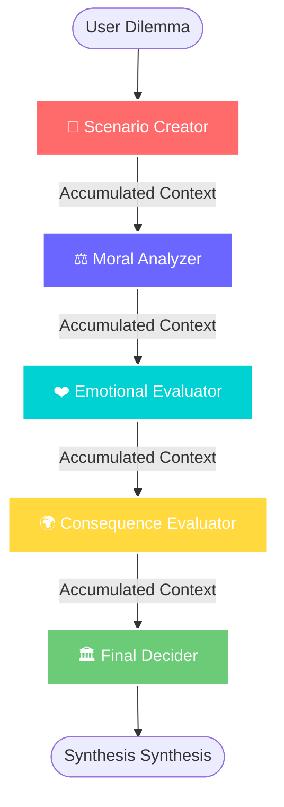

<div align="center">
  

  [](https://github.com/SubashSK777/Multi-Agent-AI)
  [](https://github.com/SubashSK777/Multi-Agent-AI)
  [](https://puter.com)

  <p align="center">
    <b>A high-order Multi-Agent System (MAS) leveraging recursive context-injection and sequential reasoning to solve multi-dimensional ethical dilemmas.</b>
  </p>

  
</div>

## 🧬 Core Architecture: The Multi-Agent Loop
The Nexus Engine is built on a **Sequential Multi-Agent Architecture**. It deviates from traditional single-prompt AI by distributing specialized logic across an autonomous chain of command.

### 🔄 The Recursive Context Pipeline
Unlike basic RAG or zero-shot prompts, Nexus implements a **Recursive Contextual Accumulation** system. Every agent's output is sanitized and injected as a high-fidelity prompt prefix for the succeeding specialized agent.



---

## 🛰️ Modular Agent Specialization
Each node in the Nexus MAS is a hyper-specialized specialized LLM instance:

| Agent Node | Responsibility | Strategic Objective |
| :--- | :--- | :--- |
| **Architect** | Scenario Design | Conflict isolation and variable definition |
| **Ethicist** | Moral Frameworks | Utilitarian vs Deontological mapping |
| **Sentience Hub** | Emotional Matrix | Empathetic mirroring & sentiment projection |
| **Oracle** | Future State Projection | Societal impact & historical precedent analysis |
| **Sovereign** | Integration Alpha | Weighted synthesis and definitive decisioning |

---

## ⚡ Technical Specification
- **Orchestrator:** Asynchronous sequential processing loop.
- **Inference Layer:** `Puter.ai.chat()` serverless execution.
- **State Management:** Local context persistence across agent transitions.
- **Optimization:** Dynamic prompt injection for zero-drift reasoning.

<div align="center">
  
</div>

---

## 🏗️ Deployment Intelligence
```bash
# Resonance (Protocol Ignition)
git clone https://github.com/SubashSK777/Multi-Agent-AI.git && cd Multi-Agent-AI

# Serve Autonomous Hub
python -m http.server 8000
```

---

<div align="center">
  
  <p><b>DOCUMENTATION FOR AI ENGINEERS & MAS RESEARCHERS</b></p>
  <sub>Architected by Subash SK | Powered by Quantum Inference</sub>
</div>
